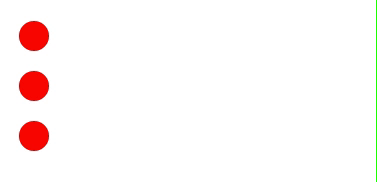
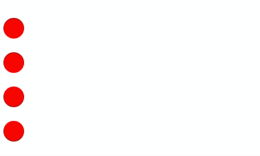
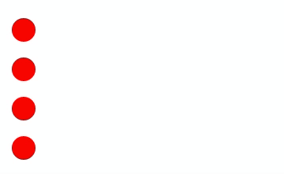

# GSAP基础&使用初体验

## 1. GSAP 是什么？

GSAP 是一个功能强大使用简单的 javascript 动画库，可以帮助开发者构建高性能和有趣的动画。

## 2. 在项目中使用 GSAP

### 2.1 安装

```bash
npm install gasp
// or
yarn add gasp
```

### 2.2 引入

```javascript
import { gsap } from "gsap";
```

## 3. GSAP 基础

### 3.1 TWEEN

一个 Tween 定义了一个对象从某个状态变为另一个状态这个动画过程，可以用 gasp 提供的方法来快速创建一个 Tween（所有这些方法都返回 Tween 实例）

```jsx
let tween = gsap.method("selector", {});
```

1. 第一个参数 target，是想要把一些属性改变进行动画的对象。可以是一个 css 选择器如`".class"`，`#id`，或者是一个元素、对象都可以。
2. 第二个参数 varsObject 包含了一些需要改变的属性参数，称为配置变量。
   - 可以是 CSS 的属性，但需要是驼峰命名的格式，比如`border-radius`需要写成 `boderRadius`。
   - 也可以是 gsap 定义的一些属性如`ease`,`duration`,`delay`或者`onComplete`等。

### 3.2 GSAP methods

GSAP 提供了很多的方法来创建动画，以下是最常用的三个方法：

1. `gsap.to(target,vars)` ：定义目标值，它会动画到目标状态。
2. `gsap.from(target,vars)`：定义值应该开始的位置，然后它会动画到当前状态。
3. `gsap.fromTo(target,fromVars,toVars)` ：定义了动画的起始值和结束值。

```javascript
gsap.from("#ball", {
  duration: 3, // 动画时间
  opacity: 0,
  y: 200,
});
```


### 3.3 Timeline

Timeline 时间轴用作多个 tween 的容器，可以方便的控制多个 tween。它不依赖于上一个 Tween 的持续时间。
这样我们想写一组动画时就不需要为第二个、第三个动画设置 delay 来延迟。

Timeline 可以这样创建：

```javascript
gsap.timeline();
```

```javascript
gsap
  .timeline()
  .to("#ball0", { x: 300, duration: 3 })
  .to("#ball1", { x: 300, duration: 3 })
  .to("#ball2", { x: 300, duration: 3 });
```



### 3.4 Easing

Easing 来定义一个对象如何从一个状态变换成另一个状态。它可以轻松控制 GSAP 中动画的变化率，并用来设置对象动画的样式。

官方提供了这个[可视化工具](<[https://greensock.com/docs/v3/Eases](https://greensock.com/docs/v3/Eases)>)来帮助开发者选择你想要的样式。

还提供了 3 种类型`in`,`out`,`inOut`来定义动画是在开始、结束、开始和结束采用某种效果。

如果不进行 ease 定义的话，gsap 默认是采用`"power1.out"`效果。

```javascript
gsap
  .timeline()
  .to("#ball0", { x: 300, ease: "bounce", duration: 3 })
  .to("#ball1", { x: 300, ease: "bounce.in", duration: 3 })
  .to("#ball2", { x: 300, ease: "bounce.out", duration: 3 })
  .to("#ball3", { x: 300, ease: "bounce.inOut", duration: 3 });
```



### 3.5 Position

Position 是使用 timeline 进行动画的重要参数，因为它设置了动画序列中的 tween 的插入点。
例如上面的 demo，我们想要控制四个球的动画开始时间，而不是上一个结束后播放下一个这样。

```javascript
gsap.method( target, {config object}, position )
```

position 的默认值是"+=0"，是在上一个 tween 结束时开始。

```javascript
gsap
  .timeline()
  .to("#ball0", { x: 300, duration: 2 })
  .add("spanAnimate", "+=1") // 在上个时间线结束后添加一个1秒后的标签
  .to("#ball1", { x: 300, duration: 2 }, "-=1") // 在上个时间线结束的前1秒开始
  .to("#ball2", { x: 300, duration: 2 }, "spanAnimate") // 使用spanAnimate标签
  .to("#ball3", { x: 300, duration: 2 }, "<"); // 和上个时间线一起
```



[官方的 Position 文档参考](https://greensock.com/position-parameter)

## 4. 插件

插件为 GSAP 的核心添加了一些额外的功能。这样做使得 GSAP 可以保持较小的内核，当需要使用一些额外的功能的时候我们可以添加一些插件来实现。
官方文档列举了完整的[插件列表](https://greensock.com/docs/v3/GSAP/docs/v3/Plugins)可供查看，这里提两个目前用到的插件~

### 4.1 ScrollTrigger 插件

```JavaScript
import { gsap } from "gsap";
import { ScrollTrigger } from "gsap/ScrollTrigger";

// 注册一下插件防止打包被tree shaking
gsap.registerPlugin(ScrollTrigger);
```

我们在写动画时通常想要页面滚动到该元素时再开始播放动画，而不是 DOM 加载完成后就开始播放动画。利用 gsap 提供的 ScrollTrigger 插件就很容易实现这一功能。

```javascript
gsap.to(".box", {
  scrollTrigger: ".box", // 当".box"进入视口后开始播放动画
  x: 500,
  duration: 3,
});
```

还有一些高级用法和自定义用法，例如：
不需要直接把 ScrollTriggers 放入动画定义中,而是创建一个 ScrollTrigger，在它的回调函数里做一些动画。

```javascript
ScrollTrigger.create({
  trigger: "#id",
  start: "top top",
  endTrigger: "#otherID",
  end: "bottom 50%+=100px",
  onToggle: (self) => console.log("toggled, isActive:", self.isActive),
  onUpdate: (self) => {
    console.log(
      "progress:",
      self.progress.toFixed(3),
      "direction:",
      self.direction,
      "velocity",
      self.getVelocity()
    );
  },
  onEnter: function () {
    animateFrom("#id");
  },
  onEnterBack: function () {
    animateFrom("#id", -1);
  },
  onLeave: function () {
    hide("#id");
    console.log("leave");
  },
});
```
eg:

### 4.2 ScrollToPlugin 插件

用于页面/元素的滚动动画。

```javascript
import { gsap } from "gsap";
import { ScrollToPlugin } from "gsap/ScrollToPlugin";

// 注册一下插件防止打包被tree shaking
gsap.registerPlugin(ScrollToPlugin);
```

可以配合一些事件滚动 window 到一个合适的位置。

```javascript
gsap.to(window, { duration: 2, scrollTo: 400 });
```

或者滚动一个元素的内容,很简单就可以自定义动画效果做出轮播图等动画:

```javascript
gsap.to(myDiv, { duration: 2, scrollTo: 250 });
```
eg:
```javascript
const clickEvent = (index:number) => {
  gsap.to("#tool-banner", {
    duration: 2,
    scrollTo: {
      y: "#tool-bannerImg" + index,
      offsetY: 0,
    },
    ease: "power2",
  });
};
```

