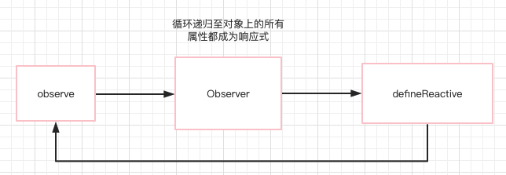
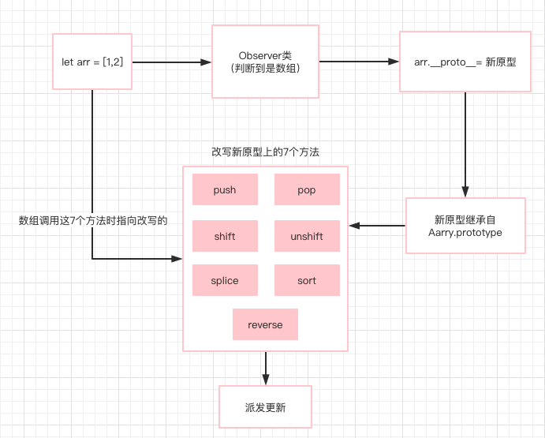
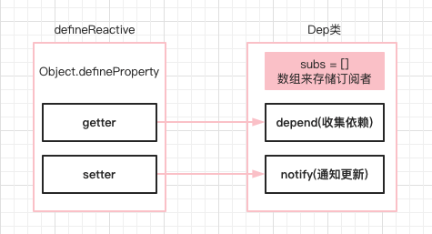
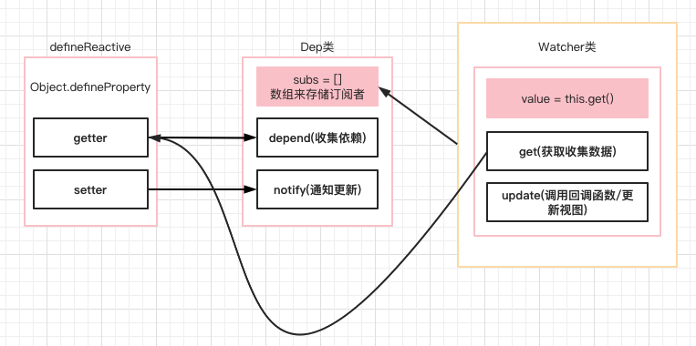

# Vue响应式原理

vue的响应式原理分为以下几步：

1. 通过Object.defineProperty()劫持数据的getter和setter
2. 首次渲染触发getter收集对数据的依赖。
3. 当数据更新触发setter时，通知对应的依赖去执行回调或更新视图变化。

## 什么叫响应式？

当不用框架时，我们更新了数据，需要手动用js去更改html上的值才能引起视图的变化。响应式就是当数据变更了，使用数据的视图也自动变化了，而不需要我们去管理。

## 劫持！响应式实现基础：Object.defineProperty()

> Object.defineProperty() 方法会直接在一个对象上定义一个新属性，或者修改一个对象的现有属性，并返回此对象。（来自MDN）

Vue是使用Object.defineProperty方法来进行数据劫持/数据代理，检测对象属性的变化，重新定义属性的getter和setter，所以在获取属性/设置属性的时候，我们都能做一些自定义的行为。

```jsx
const obj = {}
let value

// 这样定义的话，只要去读a属性，就会触发getter函数
// 设置a属性，就会触发setter函数
Object.defineProperty(obj,'a',{
    get() {
        console.log('getter')
        return value
    },
    set(newValue) {
        console.log('setter')
        value = newValue
    }
})

console.log(obj.a) // getter undefined
obj.a = 3 // setter
console.log(obj.a) // getter 3
```

因为需要一个临时变量value来周转getter和setter，所以我们利用函数的闭包特性，把这个函数封装为`defineReactive`。

```jsx
const obj = {}
// 第三个参数value 即构造了一个闭包环境
function defineReactive(data,key,value = data[key]) {
    Object.defineProperty(data,key,{
        get() {
            console.log('getter')
            return value
        },
        set(newValue) {
            console.log('setter')
		    if(value === newValue) return;
            value = newValue
        }
    })
}

defineReactive(obj,'a',1) // 监测a属性(把a属性变为响应式)

obj.a = 3 // setter
console.log(obj.a) // getter 3
```

## 递归侦测对象的所有属性：observe()和Observer

由上基础，我们已经可以通过利用defineReactive监测对象的某个属性。如果对象含有多个属性我们都要监测，那么我们可以遍历该对象，给每个属性都调用defineReactive使其可监测。所以我们可以实现一个Observer类并传入对象。

```jsx
// Oberser 类
// 将一个正常的object对象转换为每个层级的属性都是响应式的。
class Observer {
  constructor(obj) {
	  // 把Observer实例挂载到对象的__ob__上
	  def(value, "__ob__", this, false);
      this.walk(obj);
  }

  // 遍历对象
  walk(obj) {
    for (let key in obj) {
      defineReactive(obj, key);
    }
  }
}

// 通用的def方法
function def(obj, key, value, enumerable) {
  Object.defineProperty(obj, key, {
    value,
    enumerable,
    writable: true,
    configurable: true,
  });
};
```

用一个observe函数先来做一些判断，符合条件再把对象传入Observer类进行遍历：

```jsx
// 创建observe函数
function observe(value) {
  // 如果obj不是对象，什么都不做
  if (!(value instanceof Object)) return;
	  var ob;
  if(typeof value.__ob__ !== 'undefined') { // 这一步判断是为了防止重复的Observer
      ob = value.__ob__; 
  } else {
      ob = new Observer(value)
  }
  return ob;
}
```

此时，我们把一个对象传入observe函数里，即可实现对对象里每个属性的监听。

```jsx
let obj = {
  a: 1,
  b: 33,
	c: 'hello'
};
observe(obj);
```

那如果对象里的属性值也是一个对象呢？继续把属性的值传入`observe`函数形成递归，循环调用进行监听即可。让我们来改造`defineReactive`：

```jsx
function defineReactive(data,key,value = data[key]) {
	observe(value) // + 对属性值也要进行observe

    Object.defineProperty(data,key,{
        get() {
            console.log('getter')
            return value
        },
        set(newValue) {
            console.log('setter')
			if(value === newValue) return;
            value = newValue
			observe(newValue) // + 同时对新设置的值也要进行observe
        }
    })
}
```

至此，不管对象的层级有多深，我们通过三个函数来递归循环调用对里面的每个属性都进行了监测。到现在的完整代码如下：

```jsx
// 创建observe函数
function observe(value) {
  // 如果obj不是对象，什么都不做
  if (!(value instanceof Object)) return;
	var ob;
  if(typeof value.__ob__ !== 'undefined') {
      ob = value.__ob__;
  } else {
      ob = new Observer(value)
  }
  return ob;
}

// Oberser 类
// 将一个正常的object对象转换为每个层级的属性都是响应式的。
class Observer {
  constructor(obj) {
	// 把Observer实例挂载到对象的__ob__上
	def(value, "__ob__", this, false);
    this.walk(obj);
  }

  // 遍历对象
  walk(obj) {
    for (let key in obj) {
      defineReactive(obj, key);
    }
  }
}

// 对Object.defineProperty()的封装
function defineReactive(data,key,value = data[key]) {
    observe(value)

    Object.defineProperty(data,key,{
        get() {
            console.log('getter')
            return value
        },
        set(newValue) {
            console.log('setter')
		    if(value === newValue) return;
            value = newValue
		    observe(newValue)
        }
    })
}

let object = {
  a: {
    aa: 1,
    ab: "ab",
  },
  b: 3,
};

observe(object) // object里面的所有属性现在都变成可监测的啦！
```



## 对数组的特殊处理：代理原型重写其七个原生方法

由于Object.defineProperty不能监听到数组的增加或删除及length(这个属性的configurable为false)的变动，Vue对数组做了特殊的处理。

Vue拦截了数组的原型Array.prototype，并对其中七个能改变数组自身的方法进行了重写。

```jsx
// 得到Array.prototype
const arrayPrototype = Array.prototype;

// 以Array.prototype为原型创建arrayMethods对象
const arrayMethodsObject = Object.create(arrayPrototype);

// 7个可以改变数组自身的方法
const methodsNeedChange = [
    'push',
    'pop',
    'shift',
    'unshift',
    'splice',
    'sort',
    'reverse'
]

methodsNeedChange.forEach(methodName => {
    // 备份原来的方法
    const originalMethod = arrayMethodsObject[methodName]

	// 重写7个方法到arrayMethodsObject上
    def(arrayMethodsObject,methodName,function() {

        const args = [...arguments]

		// 调用原来的方法
        const result = originalMethod.apply(this,args)

		// this指向当前调用方法的这个数组，数组上有个__ob__属性
        const ob = this.__ob__

        let inserted;

        switch(methodName) {
            case 'push':
            case 'unshift':
                inserted = args;
                break;
            case 'splice':
                inserted = args.slice(2)
                break;
        }

        // 如果有插入的新项，把新项也变成响应式的。
        if(inserted) {
            ob.observeArray(inserted)
        }

		// 做一些操作，派发更新
		DoSomething()

        return result;

    },false)
})
```

有了这个被重写过7个方法的arrayMethodsObject之后，我们可以在Observer类中判断如果是数组，则让其原型指向arrayMethodsObject。

```jsx
// Oberser 类
// 将一个正常的object对象转换为每个层级的属性都是响应式的。
class Observer {
  constructor(obj) {
	def(value, "__ob__", this, false);
	if (Array.isArray(value)) { // + 如果传入的是数组
	    Object.setPrototypeOf(value, arrayMethodsObject);// + 绑定新原型
	    this.observeArray(value); // + 数组里面可能还有对象，递归observe
	} else {
	    this.walk(value);
	}
  }

  // 遍历对象
  walk(obj) {
    for (let key in obj) {
      defineReactive(obj, key);
    }
  }

	// + 数组的特殊遍历
  observeArray(arr) {
    for (let i = 0, l = arr.length; i < l; i++) {
      // 逐项进行observe
      observe(arr[i]);
    }
  }
}
```



## 收集依赖、派发更新背后的支持：发布-订阅模式

发布订阅模式可以在对象改变发生时通知多个"观察"该对象的其他对象去做一些操作。

**类比生活中：**

假如你（订阅者）订阅了一份杂志，就不需要每天去报摊看是否有最新出版的。出版社（发布者）会在每期最新的杂志出版后邮寄到你家里。这里出版社会维护一个订阅者列表，当新杂志出版后，会给这个列表里的每一个订阅者寄出。当订阅者不想继续订阅，可随时从该列表中退出。

**回到代码里：**

在Vue中，我们的订阅者就叫做Watcher，监听某个或多个属性（目标）。每个属性都应该维护一个自身的订阅者列表，但这里我们并不自己来维护，而是把这个工作委派给一个专门从事此工作的特殊帮手对象Dep。

## 得力帮手Dep：依赖收集分发器

Dep负责维护这个订阅者列表，收到某些通知时往列表里添加订阅者（依赖收集），收到改变通知时通知列表里所有的订阅者做更新视图的操作（派发更新）。

```jsx
class Dep {
  constructor() {
    // 用一个数组来存储自己的订阅者Watcher实例
    this.subs = [];
  }
  // 添加订阅
  addSub(watcher) {
    this.subs.push(watcher);
  }
  // 收集依赖
  depend() {
    // Dep.target 就是一个我们自己指定的全局的位置，全局唯一
    // Dep.target 其实就是watcher
		// 最终会调用addSub
    if(Dep.target) {
      Dep.target.addDep(this)
    }
  }
  // 通知更新
  notify() {
    // 浅克隆一份
    const subs = this.subs.slice();
    // 遍历数组
    for (let i = 0, l = subs.length; i < l; i++) {
	  // 调用对应的Watcher，更新视图
      subs[i].update();
    }
  }
}
```

而在`defineReactive`里，我们进行依赖的收集和更改时的通知。

```jsx
function defineReactive(data,key,value = data[key]) {

	const dep = new Dep() // + 为每个属性都创建一个Dep来做帮手

	let childob = observe(value)

    Object.defineProperty(data,key,{
        get() {
            // Dep.target即当前watcher，全局唯一
            if(Dep.target) {
			  dep.depend() // + 存在就进行依赖的收集(依赖收集)
			  if(childob) {
				  childob.dep.depend() // + 结合下面Observer类一起看~
			  }
		    }
            return value
        },
        set(newValue) {
		    if(value === newValue) return;
            value = newValue
		    childob = observe(newValue)
			// + 发生改变时通知订阅者，更新视图(派发更新)
            dep.notify()
        }
    })
}
```

这样每个属性都有自己的一个Dep，Dep里面放着对自身订阅的订阅者Watcher们。



同时，可想到由于这个dep是个局部变量，监听数组变化进行派发更新时并不能访问到这个dep。所以Vue在Observer里也来了一个dep供数组访问。

```jsx
// Oberser 类
// 将一个正常的object对象转换为每个层级的属性都是响应式的。
class Observer {
  constructor(obj) {
	  this.dep = new Dep();// + 每个Observer实例上都挂载一个dep实例
	  def(value, "__ob__", this, false);
	  if (Array.isArray(value)) {
	    Object.setPrototypeOf(value, arrayMethodsObject);
	    this.observeArray(value);
	  } else {
	    this.walk(value);
	  }
  }
	...
}
```

这样我们在触发重写的方法的时候也可以拿到dep进行notify了~

```jsx
methodsNeedChange.forEach(methodName => {
    // 备份原来的方法
    const originalMethod = arrayMethodsObject[methodName]

	// 重写7个方法到arrayMethodsObject上
    def(arrayMethodsObject,methodName,function() {

        const args = [...arguments]

		// 调用原来的方法
        const result = originalMethod.apply(this,args)

		// this指向当前调用方法的这个数组，数组上有个__ob__属性
        const ob = this.__ob__

        let inserted;

        switch(methodName) {
            case 'push':
            case 'unshift':
                inserted = args;
                break;
            case 'splice':
                inserted = args.slice(2)
                break;
        }

        // 如果有插入的新项，把新项也变成响应式的。
        if(inserted) {
            ob.observeArray(inserted)
        }

		// 做一些操作，派发更新
		// DoSomething()
        ob.dep.notify() // + 拿到ob上的dep，派发更新

        return result;

    },false)
})
```

## 订阅者Watcher：Dep.target到底是啥？

在初始化Watcher的时候，首先会把全局唯一的Dep.target赋值为当前Watcher对象。然后对目标属性执行一遍getter，此时当前Watcher就被这个属性收集到了，放入了Dep的数组中。

当这个属性被改变的时候，Dep会通知Watcher触发update，然后就会去执行传入的回调函数。

```jsx
class Watcher {
  constructor(target, expression, callback) {
    this.target = target;
    this.getter = parsePath(expression);
    this.callback = callback;
    this.value = this.get();
  }

  get() {
    // get方法的作用就是获取自己依赖的数据，进入依赖收集的阶段
    // 把当前Watcher实例给放到全局 Dep.target上
    Dep.target = this;
    const obj = this.target;
    var value;
    try {
      value = this.getter(obj); // 获取属性，触发getter
    } finally {
      Dep.target = null; // 执行完后赋值为NULL
    }
    return value;
  }

  addDep(dep) {
	// 把当前Watcher添加到dep数组里
    dep.addSub(this)
  }

  update() {
	// dep通知更新，去调用回调函数
    this.getAndInvoke(this.callback)
  }

  getAndInvoke(cb) {
      const value = this.get()

      if(value !== this.value || typeof value == 'object') {
          const oldValue =  this.value
          this.value = value
	      // 把新值和旧值都传入回调函数中
          cb.call(this.target,value,oldValue)
      }
  }
}

function parsePath(str) {
  var segments = str.split(".");

  return (obj) => {
    for (let i = 0; i < segments.length; i++) {
      if (!obj) return;
      obj = obj[segments[i]]; // 触发getter
    }
    return obj;
  };
}
```



## 完结撒花 & 补充~~!!✌️

```jsx
let object = {
  a: {
    aa: 1,
    ab: "hello",
  },
  b: 3,
};

observe(object)

new Watcher(object,'a.ab',(val,oldVal)=>{
    console.log('☆☆☆☆☆☆☆☆☆☆',val,oldVal)
})

object.a.ab = 1111 // ☆☆☆☆☆☆☆☆☆☆ 1111 hello
```

到这里其实已经实现了一个简易的Vue响应式~

总结下：

1. Observer将对象内的所有属性都加上响应式（getter/setter）
2. Dep管理数据的依赖列表（添加依赖和触发更新）
3. Watcher是数据的依赖，负责将数据的变化转发到外界来触发回调或者视图更新